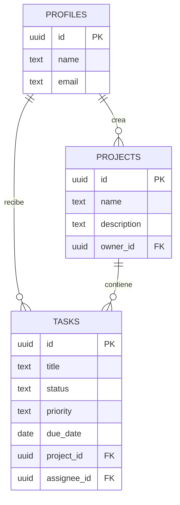

# TaskFlow - Gestion de Tareas Colaborativas

Aplicacion web CRUD para crear proyectos, organizar tareas, asignar responsables y dar
seguimiento al progreso. Fue construida como proyecto full-stack para desplegar en Vercel
y usar Supabase como base de datos online y proveedor de autenticacion.

## Funcionalidades

- Registro e inicio de sesion de usuarios.
- CRUD completo de proyectos.
- CRUD completo de tareas relacionadas con proyectos.
- Asignacion de tareas a usuarios registrados.
- Estado, prioridad y fecha limite por tarea.
- Busqueda y filtros por proyecto, estado y prioridad.
- Dashboard con estadisticas y tareas recientes.
- Interfaz responsive con mensajes de exito y error.

Con esto se cumplen cuatro requisitos de complejidad media-alta: autenticacion, relaciones
entre entidades, filtros avanzados y dashboard.

## Tecnologias

- Frontend: HTML5, CSS3 y JavaScript.
- Backend: Node.js como funcion serverless.
- Base de datos y autenticacion: Supabase (PostgreSQL + Supabase Auth).
- Despliegue: Vercel.
- Control de versiones: Git y GitHub.

## Modelo de datos



## Configuracion de Supabase

1. Crea un proyecto gratuito en [Supabase](https://supabase.com/).
2. Abre **SQL Editor**, copia el contenido de `supabase/schema.sql` y ejecutalo.
3. En **Authentication > Providers > Email**, desactiva temporalmente la confirmacion de
   correo si deseas probar registros sin configurar un servidor de correo.
4. Copia `.env.example` como `.env` y completa:

```env
SUPABASE_URL=https://TU-PROYECTO.supabase.co
SUPABASE_ANON_KEY=tu_clave_anon
SUPABASE_SERVICE_ROLE_KEY=tu_clave_service_role
```

La clave `SUPABASE_SERVICE_ROLE_KEY` solo debe configurarse en el servidor. Nunca debe
publicarse ni utilizarse directamente desde el navegador.

## Ejecucion local

Requiere Node.js 20 o superior. No necesita instalar dependencias.

```bash
npm run dev
```

Abre `http://localhost:3000`.

Para validar la sintaxis:

```bash
npm run check
```

## Despliegue en Vercel

2. En Vercel, selecciona **Add New > Project** e importa el repositorio.
3. Agrega `SUPABASE_URL`, `SUPABASE_ANON_KEY` y `SUPABASE_SERVICE_ROLE_KEY` en
   **Settings > Environment Variables**.
4. Despliega el proyecto.

URL del sistema desplegado: `PENDIENTE_AGREGAR_URL_DE_VERCEL`

## Endpoints principales

| Metodo | Ruta | Descripcion |
|---|---|---|
| POST | `/api/auth/register` | Registrar usuario |
| POST | `/api/auth/login` | Iniciar sesion |
| GET/POST | `/api/projects` | Listar o crear proyectos |
| PUT/DELETE | `/api/projects/:id` | Editar o eliminar proyecto |
| GET/POST | `/api/tasks` | Listar, filtrar o crear tareas |
| PUT/DELETE | `/api/tasks/:id` | Editar o eliminar tarea |

## Capturas de pantalla

Agrega aqui capturas del sistema desplegado antes de entregar:

- Pantalla de autenticacion.
- Dashboard.
- Listado de proyectos.
- CRUD y filtros de tareas.
