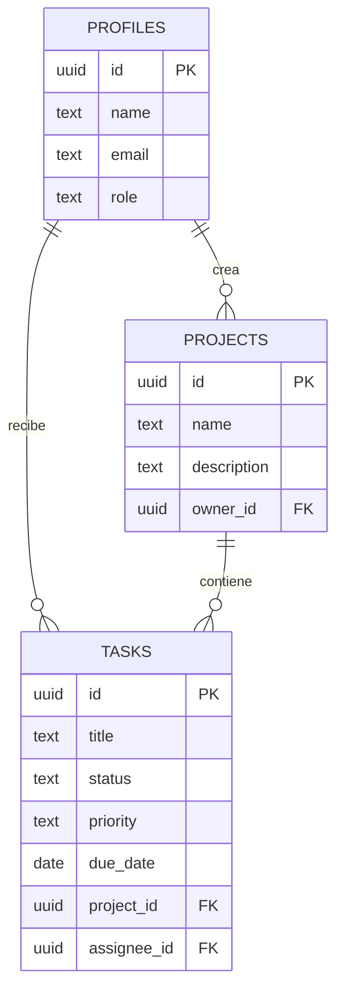

# TaskFlow - Sistema de Gestión de Tareas Colaborativas

## Descripción

TaskFlow es una aplicación web CRUD para gestionar proyectos y tareas colaborativas.
Permite registrar usuarios, crear proyectos, asignar responsables y realizar seguimiento
del trabajo mediante prioridades, estados y fechas límite.

El sistema utiliza Supabase como base de datos online y proveedor de autenticación, y se
encuentra desplegado en Vercel.

## Funcionalidades

- Registro e inicio de sesión sin verificación por correo.
- CRUD completo de proyectos y tareas.
- Asignación de tareas a usuarios registrados.
- Prioridad, estado y fecha límite por tarea.
- Búsqueda y filtros por proyecto, estado y prioridad.
- Dashboard con estadísticas y tareas recientes.
- Roles de usuario: `admin` y `usuario`.
- Interfaz adaptable con mensajes de éxito y error.

## Roles y permisos

### Administrador

- Consulta y administra todos los proyectos y tareas.
- Crea, edita y elimina proyectos y tareas.
- Consulta los usuarios registrados.
- Asigna o retira el rol de administrador.
- No puede quitarse su propio rol para evitar dejar el sistema sin administración.

### Usuario

- Crea y administra sus propios proyectos.
- Crea, edita y elimina tareas de sus proyectos.
- Consulta las tareas que le hayan asignado.
- Asigna tareas a usuarios registrados.
- No puede modificar roles.

La aplicación cumple cinco requisitos de complejidad media-alta: autenticación, relaciones
entre entidades, filtros avanzados, roles de usuario y dashboard.

## Tecnologías

- Frontend: HTML5, CSS3 y JavaScript.
- Backend: Node.js mediante funciones serverless.
- Base de datos: PostgreSQL en Supabase.
- Autenticación: Supabase Auth.
- Despliegue: Vercel.
- Control de versiones: Git y GitHub.

## Modelo de datos



## Configuración de Supabase

1. Crea un proyecto en [Supabase](https://supabase.com/).
2. Abre **SQL Editor**.
3. Copia todo el contenido de `supabase/schema.sql` y ejecútalo.
4. Si las tablas ya existían, vuelve a ejecutar el archivo. La migración añadirá la columna
   `role` sin eliminar los datos.
5. El usuario más antiguo se convierte automáticamente en administrador si todavía no
   existe uno.
6. Copia `.env.example` como `.env` y completa:

```env
SUPABASE_URL=https://TU-PROYECTO.supabase.co
SUPABASE_ANON_KEY=tu_clave_anon
SUPABASE_SERVICE_ROLE_KEY=tu_clave_service_role
```

`SUPABASE_SERVICE_ROLE_KEY` solo debe configurarse en el servidor. Nunca debe publicarse
ni utilizarse directamente desde el navegador.

## Ejecución local

Requiere Node.js 20 o superior y no necesita instalar dependencias.

```bash
git clone https://github.com/aslhyy/Gestion-Tareas.git
cd Gestion-Tareas
```

Crea el archivo `.env` y ejecuta:

```bash
npm run dev
```

Abre `http://localhost:3000`.

Para validar la sintaxis:

```bash
npm run check
```

## Despliegue

URL pública:

[https://gestion-tareas-mocha.vercel.app](https://gestion-tareas-mocha.vercel.app)

Para desplegar una copia:

1. Importa el repositorio desde Vercel.
2. Configura `SUPABASE_URL`, `SUPABASE_ANON_KEY` y `SUPABASE_SERVICE_ROLE_KEY`.
3. Ejecuta el despliegue.

## Endpoints principales

| Método | Ruta | Descripción |
|---|---|---|
| POST | `/api/auth/register` | Registrar un usuario |
| POST | `/api/auth/login` | Iniciar sesión |
| GET | `/api/me` | Consultar el perfil autenticado |
| GET | `/api/profiles` | Listar usuarios |
| PUT | `/api/profiles/:id` | Cambiar un rol, solo para administradores |
| GET/POST | `/api/projects` | Listar o crear proyectos |
| PUT/DELETE | `/api/projects/:id` | Editar o eliminar un proyecto |
| GET/POST | `/api/tasks` | Listar, filtrar o crear tareas |
| PUT/DELETE | `/api/tasks/:id` | Editar o eliminar una tarea |

## Capturas de pantalla

### Inicio de sesión


### Registro de usuarios


### Dashboard principal


### Gestión de proyectos


### Gestión de tareas


### Creación de proyectos


### Creación de tareas


### Filtros de búsqueda


## Autor

**Aslhy Nicol Casteblanco Jiménez**  
Aprendiz ADSO - SENA
